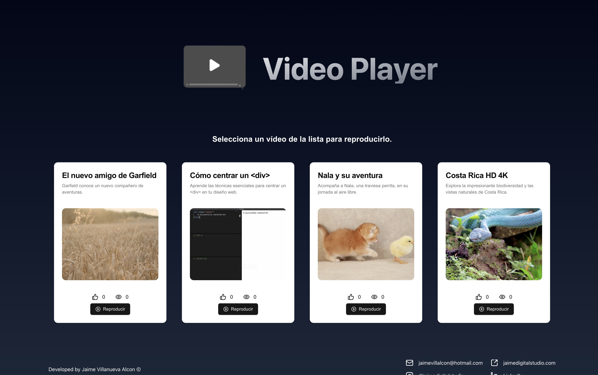
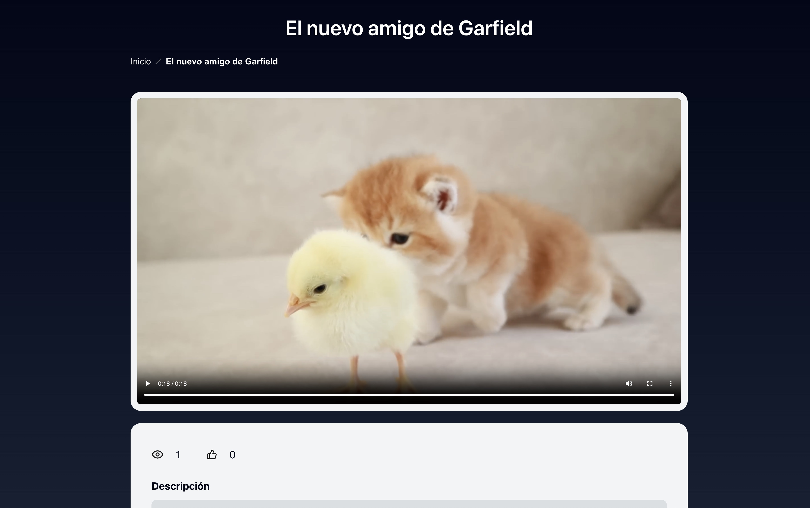
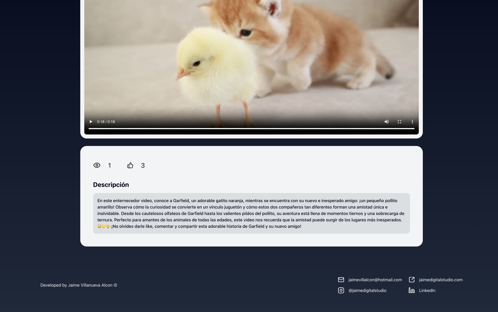

## **Video Player App**
Prueba técnica para Vidext de un reproductor de videos hecho con Next.js >15.

## **ÍNDICE**
- [Instrucciones de Configuración](#instrucciones-de-configuración)
- [Cómo Ejecutar la Aplicación](#cómo-ejecutar-la-aplicación)
- [Pruebas de las API con tRPC](#pruebas-de-las-api-con-trpc)
- [Cómo Usar la Aplicación](#cómo-usar-la-aplicación)

---

## **Instrucciones de Configuración**
  1. Clonar el repositorio:
```bash
git clone https://github.com/your-username/video-player-app.git
cd video-player-app
```

  2. Instalar las dependencias (método legacy por incompatibilidad con React 19)
```bash
npm install --legacy-peer-deps
```
---

## **Cómo Ejecutar la Aplicación**
1. Modo desarrollador:
```bash
npm run dev
```

2. Modo produccion:
```
npm run build
npm run start
```

---

## **Pruebas de las API con tRPC**
1. Instalar Dependencias de Pruebas: Asegúrate de tener instalados jest y las demás dependencias necesarias:
```
npm install --save-dev jest supertest --legacy-peer-deps
```

2. Ejecutar las pruebas:
```
npm run test
```

3. Revisar Resultados: Las pruebas validarán los endpoints de la API, verificando funcionalidades como:
· Obtener todos los videos.
· Obtener un video por ID.
· Incrementar las vistas y los "me gusta".

---

## **Cómo Usar la Aplicación**
1. Página principal:
   - La página principal muestra una lista de todos los videos.
   - Cada vídeo tiene la información básica de título, subtítulo, imagen de previsualización e información de actividad de usuario de número de visitas y likes.
   - Para acceder a un vídeo se debe hacer click en un vídeo de la lista.
     


2. Reproductor de vídeo:
   - Se muestra el reproductor de vídeo automático del elemento de la lista seleccionado.
   - La página contiene el título del vídeo, un menu Breadcrumb para saber en qué página se ubica y poder volver atrás.
   - Los controles del vídeo se encuentran al pasar el ratón por encima de la imagen.
   - El vídeo se reproduce automáticamente al cargar la página.
     


3. Dar Like a un vídeo:
   - En el contenedor debajo de la imagen del vídeo, puede hacer click sobre la mano con pulgar arriba para registrar un nuevo like.
   - Después puede hacer click en 'Inicio' en el menú y podrá ver registrados el número de likes y visualizaciones acumuluadas en cada vídeo.
   - Las visualizaciones se aumentan automáticamente al abrir la página de vídeo mediante SSR.
     


---
